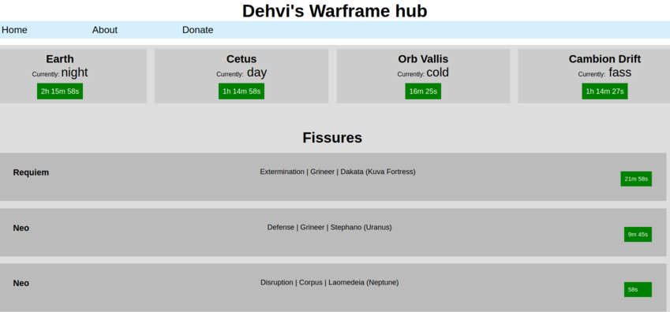
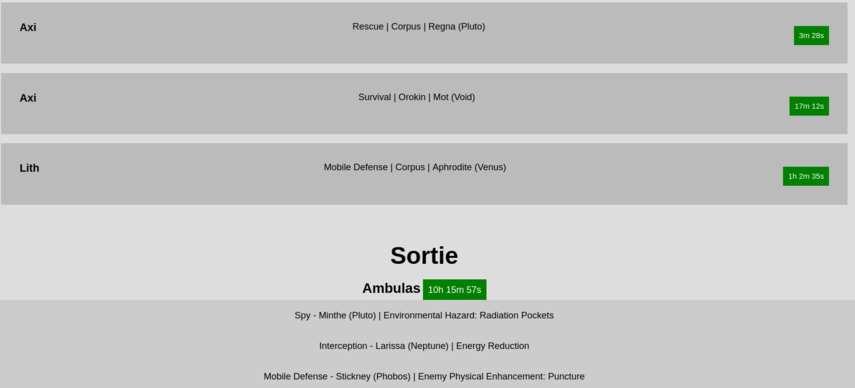
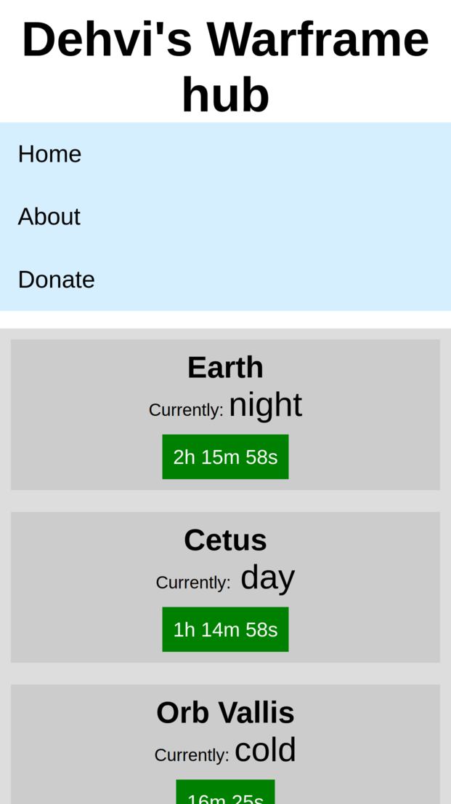

# Warframe hub

This is a hub for a game called Warframe. This uses API from https://docs.warframestat.us/ to pull information about game events and shows them on flask website.

# Motivation

I come up with this project to learn about using flask to show a website and pulling information from an api to the site. I also learned a bit about creating responsive websites.

# How does it work?
Using: Flask and requests libraries.

This projects works by running the hub.py which then uses the getWarframeStatus.py to get the API data, parses the necessary parts from the json files and then shows on the index.html. 

### The page does not refresh the timers automatically because hub.py runs the app only once. 
_I might later come back to this and fix it to refresh the timers..._

# Installation

```
clone the repo 
pip -r requirements.txt

python hub.py
```

# Screenshots






# Goal of this project

Goal of this project was to learn about creating a website, using flask and getting data from an API to the page.
